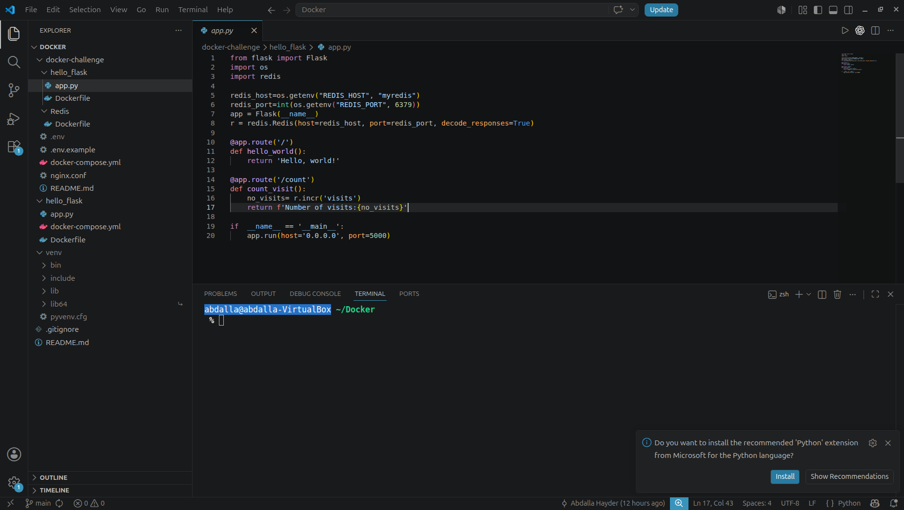
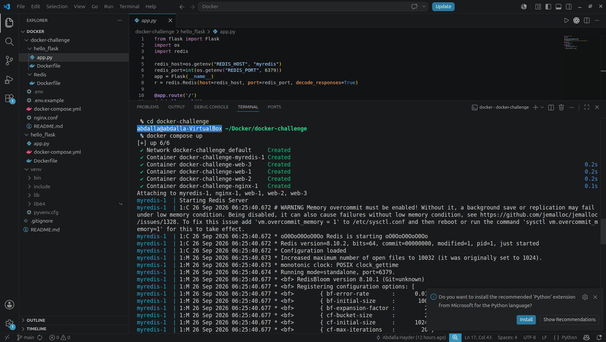

# CoderCo Containers Challenge

## Overview

This project was completed as part of the CoderCo Docker module.
The goal was to build a multi-container application using a Python Flask web application and Redis, then manage the services using Docker Compose.
The project was later imporved with persistent Redis storage, environment variables, multiple Flask replicas, and NGINX load balancing.

## Architecture

```text
                Browser
                   |
                   v
             NGINX :5000
                   |
          -------------------
          |        |        |
          v        v        v
       Flask    Flask     Flask
       web-1    web-2     web-3
          \        |        /
           \       |       /
            ------ Redis ------
                    |
                    v
             Persistent Volume
```


## Technologies Used

- Dcoker
- Docker Compose
- Python
- Flask
- Redis
- NGINX

## Project Structure

```text
docker-challenge/
├── hello_flask/
│   ├── app.py
│   └── Dockerfile
├── Redis/
│   └── Dockerfile
├── screenshots/
├── .env.example
├── docker-compose.yml
├── nginx.conf
└── README.md
```

### Project Structure



## Flask Application

The Flask application contains two routes:
- '/' -displays a welcome message.
- '/count' -increments and displays a visit counter stored in Redis.

### Welcome Page


